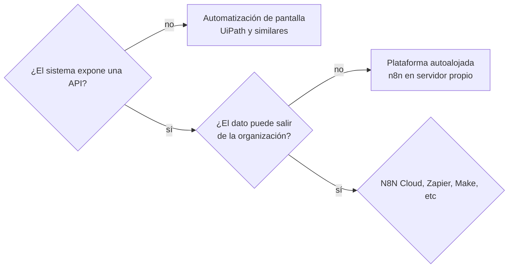
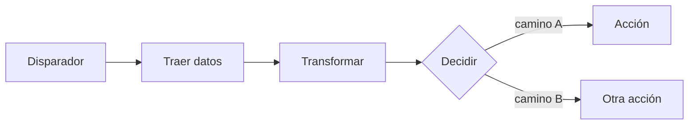
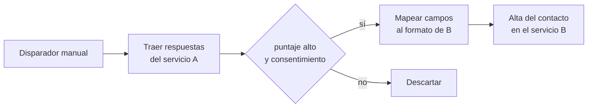

# Seminario de Automatización

<div class="wire"><span></span></div>

<div class="text-xl">Clase 1</div>
<div class="lead mt-1">Introducción a la automatización. Herramientas y primeros flujos.</div>

<div class="mute text-sm mt-14">
Tecnicatura Universitaria en Programación<br>
Gonzalo Bechara Balaldi
</div>

<!--
Bienvenida breve. No arrancar con la herramienta: primero el problema.
Pregunta de apertura para el aula: "¿qué tarea repetitiva hicieron esta semana
que una máquina podría haber hecho?" Anotar dos o tres en el pizarrón y
retomarlas en la diapositiva de criterios.
-->

---


## Qué se van a llevar

<div class="grid grid-cols-2 gap-x-10 gap-y-3 mt-6 text-sm">

<div v-click class="box">Elegir con criterio entre Zapier, Make, n8n, UiPath o un script propio, y saber por qué</div>
<div v-click class="box">Modelar un proceso como flujo: disparador, datos, nodos, acciones</div>
<div v-click class="box">Hacer que sistemas que no se conocen entre sí intercambien información</div>
<!-- <div v-click class="box">Versionar automatizaciones en Git, como cualquier otro código</div> -->
<div v-click class="box">Integrar APIs sin nodo dedicado, con manejo de errores y aviso de fallas</div>
<div v-click class="box">Sumar un modelo de lenguaje donde corresponde, y reconocer cuándo no</div>
<div v-click class="box">Poner revisión humana donde la confianza no alcanza</div>
<div v-click class="box">Tendrán una habilidad clave en el ambiente laboral actual</div>
<div v-click class="box">Ejemplos prácticos trasladables a ambientes reales</div>
<!-- <div v-click class="box">Operar una instancia propia y resolver OAuth2 contra servicios reales</div> -->

</div>

<!--
Leerlos rápido. No detenerse. Sirve como mapa, no como contenido.
-->

---


# Qué es automatizar

<div class="wire"><span></span></div>

<!-- <div class="mute">40 minutos de desarrollo teórico</div> -->

---

# Qué es automatizar
## Pensemos en un proceso


<div class="grid grid-cols-4 gap-3 mt-6 text-xs">
<div class="box"><b class="sig">Disparador</b><div class="mute mt-1">Qué hace que el proceso arranque. Una hora, un evento, una persona.</div></div>
<div class="box"><b class="sig">Entrada</b><div class="mute mt-1">Con qué datos empieza y de dónde salen.</div></div>
<div class="box"><b class="sig">Pasos</b><div class="mute mt-1">Qué transformación sufre el dato en cada tramo.</div></div>
<div class="box"><b class="sig">Salida</b><div class="mute mt-1">Qué queda hecho cuando terminó, y cómo se verifica.</div></div>
</div>

<div class="lead mt-8">
Automatizar es escribir este dibujo de manera que se ejecute solo.
</div>

<!--
Punto clave del día: si no podés dibujar esto en un papel, no lo podés automatizar.
La herramienta no reemplaza el análisis del proceso, lo ejecuta.
-->

---

## Lo que automatizar no es

<div class="grid grid-cols-2 gap-6 mt-8 text-sm">

<div>
<div class="box box-warn mb-3">No es "que la computadora se dé cuenta". Alguien tiene que haber escrito la regla, aunque sea con el mouse.</div>
<div class="box box-warn mb-3">No es necesariamente inteligencia artificial. La enorme mayoría de lo que vamos a construir es determinista y no tiene un modelo adentro.</div>
</div>

<div>
<div class="box box-warn mb-3">No es gratis. Tiene costo de construcción, de plataforma y, sobre todo, de mantenimiento.</div>
<div class="box box-warn">No arregla un proceso roto (aunque muchas veces lo evidencia). Un proceso desprolijo automatizado es un proceso desprolijo que ahora falla más rápido.</div>
</div>

</div>

<!--
La última es la más importante y la que más cuesta hacer entender.
Ejemplo concreto: si el equipo carga mal los correos a mano, automatizar la carga
convierte 3 errores por semana en 300.
-->

---

## Tres niveles, según cuánto hay que decidir

<div class="mt-4 text-sm">

<div class="tramo">
<b class="ok">1</b>
<span><b>Mecánico.</b> Un proceso que tiene la misma entrada y la misma salida siempre.</span>
<em>copiar una fila a otro sistema</em>
</div>

<div class="tramo">
<b class="sig">2</b>
<span><b>Decisión estructurada.</b> Hay caminos alternativos, pero la regla se puede escribir y la condición se puede verificar. Si pagó, dar acceso.</span>
<em>bifurcar según una regla</em>
</div>

<div class="tramo">
<b class="warn">3</b>
<span><b>Decisión no estructurada.</b> No existe una regla escribible. Requiere criterio, y si la toma un agente de IA, requiere revisión.</span>
<em>clasificar la intención de un mensaje</em>
</div>

</div>

<div class="lead mt-8">
El seminario recorre los tres, en ese orden. Hoy estamos en el primero.
</div>

<!--
Preguntar al aula: de las tareas que anotamos al principio, ¿en qué nivel cae cada una?
Suele aparecer que casi todo lo que la gente quiere automatizar es nivel 1 disfrazado de nivel 3.
-->

---

## ¿Cómo se mueve la automatización?

<div class="grid grid-cols-3 gap-4 mt-8 text-sm">

<div class="box">
<b class="sig">Utiliza la interfaz gráfica</b>
<div class="mute mt-2">El robot usa la pantalla como la usaría una persona: clics, teclas, lectura de la ventana. Es lo que hace el RPA clásico.</div>
<div class="mt-3 warn text-xs">Frágil: cambia un botón de lugar y puede  romperse.</div>
</div>

<div class="box">
<b class="sig">Usa la API</b>
<div class="mute mt-2">El sistema expone un contrato y la automatización lo consume. Es donde vamos a vivir todo el seminario.</div>
<div class="mt-3 ok text-xs">Estable: Mantiene la separación de los sistemas, manteniendo alto nivel de optimización.</div>
</div>

<div class="box">
<b class="sig">Altera directamente la DB</b>
<div class="mute mt-2">Escribir directo en el almacenamiento del otro sistema, salteando su lógica.</div>
<div class="mt-3 warn text-xs">Rápido y peligroso: te salteás las validaciones que los desarrolladores pusieron en el back con criterio.</div>
</div>

</div>

<!--
El tercero aparece siempre en la vida real como atajo. Nombrarlo para poder desaconsejarlo
con argumento: te salteás las validaciones del sistema dueño del dato.
-->

---

## Qué conviene automatizar

<div class="grid grid-cols-2 gap-8 mt-6 text-sm">

<div>
<div class="ok mb-3">Buenos candidatos</div>
<ul class="mute">
<li>Se repite seguido y siempre igual</li>
<li>Los pasos se pueden escribir sin ambigüedad</li>
<li>El error es detectable o reversible</li>
<li>Las reglas llevan meses sin cambiar</li>
<li>Hoy lo hace una persona, aburrida</li>
</ul>
</div>

<div>
<div class="warn mb-3">Malos candidatos</div>
<ul class="mute">
<li>El proceso todavía no está definido</li>
<li>Cada caso es una excepción distinta</li>
<li>Corre tres veces por año</li>
<li>Un error cuesta caro y nadie lo revisa</li>
<li>El proceso está por cambiar el mes que viene</li>
</ul>
</div>

</div>

<div class="box box-sig mt-6 text-sm">
Antes de automatizar un proceso hay que <b class="sig">entenderlo</b>, y muy seguido conviene <b class="sig">simplificarlo</b> primero.
</div>

<!--
Retomar acá las tareas que anotamos al inicio de la clase y clasificarlas juntos.
Es el momento de mayor participación de la clase teórica.
-->

---

## ¿Cómo sé si me conviene automatizar? (Con números)

<div class="grid grid-cols-2 gap-8 mt-8">

<div class="box box-ok">
<div class="ok text-sm mb-2">Se gana</div>
<div class="text-sm mute">
tiempo ahorrado por corrida<br>
× cantidad de corridas<br>
× horizonte razonable<br>
<span class="mt-2 block">+ errores humanos que dejan de pasar</span>
</div>
</div>

<div class="box box-warn">
<div class="warn text-sm mb-2">Se paga</div>
<div class="text-sm mute">
tiempo de construirlo<br>
+ costo de la plataforma<br>
+ <b class="warn">mantenimiento</b><br>
<span class="mt-2 block">+ el día que falla y hay que entender por qué</span>
</div>
</div>

</div>

<div class="lead mt-8">
El mantenimiento está resaltado porque es fácil olvidarse de que a una automatización (como todo sistema) hay que mantenerla.
</div>

<!--
Anécdota útil: la automatización que ahorra 5 minutos por semana y consume 2 horas
por trimestre de arreglos. Existe, es común, y hay que saber matarla.
-->

---
layout: section
class: section-break
---

# Con qué se automatiza

<div class="wire"><span></span></div>

<div class="mute">Panorama comparado de herramientas</div>

---

## Cinco enfoques

<div class="mt-4">

| | Modelo | Dónde corre | Fuerte en | Techo |
| --- | --- | --- | --- | --- |
| **Zapier** | servicio cerrado | nube del proveedor | catálogo enorme de integraciones, cero fricción para empezar | lógica ramificada, costo por tarea ejecutada |
| **Make** | servicio cerrado | nube del proveedor | editor visual muy bueno para flujos con ramas | no hay opción de alojarlo uno mismo |
| **n8n** | fair-code | nube o servidor propio | control del dato, código embebido, extensible | alguien tiene que operar la instancia |
| **UiPath** | RPA | máquina de escritorio | sistemas viejos sin API, automatización de pantalla | frágil ante cambios de interfaz, licenciamiento caro |
| **Script + planificador** | código propio | donde quieras | control total, sin límites de la plataforma | todo lo demás lo escribís y lo mantenés vos |

</div>

<div class="mute text-xs mt-6">
Ninguna es mejor que las otras en abstracto. La pregunta correcta es siempre "¿para qué caso?".
</div>

<div class="flex justify-between mt-3 text-xs" v-pre>

<div class="flex flex-col items-center gap-1">
<svg class="tool-icon" viewBox="0 0 24 24" xmlns="http://www.w3.org/2000/svg"><title>Zapier</title><path fill="currentColor" d="M4.157 0A4.151 4.151 0 0 0 0 4.161v15.678A4.151 4.151 0 0 0 4.157 24h15.682A4.152 4.152 0 0 0 24 19.839V4.161A4.152 4.152 0 0 0 19.839 0H4.157Zm10.61 8.761h.03a.577.577 0 0 1 .23.038.585.585 0 0 1 .201.124.63.63 0 0 1 .162.431.612.612 0 0 1-.162.435.58.58 0 0 1-.201.128.58.58 0 0 1-.23.042.529.529 0 0 1-.235-.042.585.585 0 0 1-.332-.328.559.559 0 0 1-.038-.235.613.613 0 0 1 .17-.431.59.59 0 0 1 .405-.162Zm2.853 1.572c.03.004.061.004.095.004.325-.011.646.064.937.219.238.144.431.355.552.609.128.279.189.582.185.888v.193a2 2 0 0 1 0 .219h-2.498c.003.227.075.45.204.642a.78.78 0 0 0 .646.265.714.714 0 0 0 .484-.136.642.642 0 0 0 .23-.318l.915.257a1.398 1.398 0 0 1-.28.537c-.14.159-.321.284-.521.355a2.234 2.234 0 0 1-.836.136 1.923 1.923 0 0 1-1.001-.245 1.618 1.618 0 0 1-.665-.703 2.221 2.221 0 0 1-.227-1.036 1.95 1.95 0 0 1 .48-1.398 1.9 1.9 0 0 1 1.3-.488Zm-9.607.023c.162.004.325.026.48.079.207.065.4.174.563.314.26.302.393.692.366 1.088v2.276H8.53l-.109-.711h-.065c-.064.163-.155.31-.272.439a1.122 1.122 0 0 1-.374.264 1.023 1.023 0 0 1-.453.083 1.334 1.334 0 0 1-.866-.264.965.965 0 0 1-.329-.801.993.993 0 0 1 .076-.431 1.02 1.02 0 0 1 .242-.363 1.478 1.478 0 0 1 1.043-.303h.952v-.181a.696.696 0 0 0-.136-.454.553.553 0 0 0-.438-.154.695.695 0 0 0-.378.086.48.48 0 0 0-.193.254l-.99-.144a1.26 1.26 0 0 1 .257-.563c.14-.174.321-.302.533-.378.261-.091.54-.136.82-.129.053-.003.106-.007.163-.007Zm4.384.007c.174 0 .347.038.506.114.182.083.34.211.458.374.257.423.377.911.351 1.406a2.53 2.53 0 0 1-.355 1.448 1.148 1.148 0 0 1-1.009.517c-.204 0-.401-.045-.582-.136a1.052 1.052 0 0 1-.48-.457 1.298 1.298 0 0 1-.114-.234h-.045l.004 1.784h-1.059v-4.713h.904l.117.805h.057c.068-.208.177-.401.328-.56a1.129 1.129 0 0 1 .843-.344h.076v-.004Zm7.559.084h.903l.113.805h.053a1.37 1.37 0 0 1 .235-.484.813.813 0 0 1 .313-.242.82.82 0 0 1 .39-.076h.234v1.051h-.401a.662.662 0 0 0-.313.008.623.623 0 0 0-.272.155.663.663 0 0 0-.174.26.683.683 0 0 0-.027.314v1.875h-1.054v-3.666Zm-17.515.003h3.262v.896L3.73 13.104l.034.113h1.973l.042.9H2.4v-.9l1.931-1.754-.045-.117H2.441v-.896Zm11.815 0h1.055v3.659h-1.055V10.45Zm3.443.684.019.016a.69.69 0 0 0-.351.045.756.756 0 0 0-.287.204c-.11.155-.174.336-.189.522h1.545c-.034-.526-.257-.787-.74-.787h.003Zm-5.718.163c-.026 0-.057 0-.083.004a.78.78 0 0 0-.31.053.746.746 0 0 0-.257.189 1.016 1.016 0 0 0-.204.695v.064c-.015.257.057.507.204.711a.634.634 0 0 0 .253.196.638.638 0 0 0 .314.061.644.644 0 0 0 .578-.265c.14-.223.204-.48.189-.74a1.216 1.216 0 0 0-.181-.711.677.677 0 0 0-.503-.257Zm-4.509 1.266a.464.464 0 0 0-.268.102.373.373 0 0 0-.114.276c0 .053.008.106.027.155a.375.375 0 0 0 .087.132.576.576 0 0 0 .397.11v.004a.863.863 0 0 0 .563-.182.573.573 0 0 0 .211-.457v-.14h-.903Z"/></svg>
<span class="mute">Zapier</span>
</div>

<div class="flex flex-col items-center gap-1">
<svg class="tool-icon" viewBox="0 0 24 24" xmlns="http://www.w3.org/2000/svg"><title>Make</title><path fill="currentColor" d="M13.38 3.498c-.27 0-.511.19-.566.465L9.85 18.986a.578.578 0 0 0 .453.678l4.095.826a.58.58 0 0 0 .682-.455l2.963-15.021a.578.578 0 0 0-.453-.678l-4.096-.826a.589.589 0 0 0-.113-.012zm-5.876.098a.576.576 0 0 0-.516.318L.062 17.697a.575.575 0 0 0 .256.774l3.733 1.877a.578.578 0 0 0 .775-.258l6.926-13.781a.577.577 0 0 0-.256-.776L7.762 3.658a.571.571 0 0 0-.258-.062zm11.74.115a.576.576 0 0 0-.576.576v15.426c0 .318.258.578.576.578h4.178a.58.58 0 0 0 .578-.578V4.287a.578.578 0 0 0-.578-.576Z"/></svg>
<span class="mute">Make</span>
</div>

<div class="flex flex-col items-center gap-1">
<svg class="tool-icon" viewBox="0 0 24 24" xmlns="http://www.w3.org/2000/svg"><title>n8n</title><path fill="currentColor" d="M21.4737 5.6842c-1.1772 0-2.1663.8051-2.4468 1.8947h-2.8955c-1.235 0-2.289.893-2.492 2.111l-.1038.623a1.263 1.263 0 0 1-1.246 1.0555H11.289c-.2805-1.0896-1.2696-1.8947-2.4468-1.8947s-2.1663.8051-2.4467 1.8947H4.973c-.2805-1.0896-1.2696-1.8947-2.4468-1.8947C1.1311 9.4737 0 10.6047 0 12s1.131 2.5263 2.5263 2.5263c1.1772 0 2.1663-.8051 2.4468-1.8947h1.4223c.2804 1.0896 1.2696 1.8947 2.4467 1.8947 1.1772 0 2.1663-.8051 2.4468-1.8947h1.0008a1.263 1.263 0 0 1 1.2459 1.0555l.1038.623c.203 1.218 1.257 2.111 2.492 2.111h.3692c.2804 1.0895 1.2696 1.8947 2.4468 1.8947 1.3952 0 2.5263-1.131 2.5263-2.5263s-1.131-2.5263-2.5263-2.5263c-1.1772 0-2.1664.805-2.4468 1.8947h-.3692a1.263 1.263 0 0 1-1.246-1.0555l-.1037-.623A2.52 2.52 0 0 0 13.9607 12a2.52 2.52 0 0 0 .821-1.4794l.1038-.623a1.263 1.263 0 0 1 1.2459-1.0555h2.8955c.2805 1.0896 1.2696 1.8947 2.4468 1.8947 1.3952 0 2.5263-1.131 2.5263-2.5263s-1.131-2.5263-2.5263-2.5263m0 1.2632a1.263 1.263 0 0 1 1.2631 1.2631 1.263 1.263 0 0 1-1.2631 1.2632 1.263 1.263 0 0 1-1.2632-1.2632 1.263 1.263 0 0 1 1.2632-1.2631M2.5263 10.7368A1.263 1.263 0 0 1 3.7895 12a1.263 1.263 0 0 1-1.2632 1.2632A1.263 1.263 0 0 1 1.2632 12a1.263 1.263 0 0 1 1.2631-1.2632m6.3158 0A1.263 1.263 0 0 1 10.1053 12a1.263 1.263 0 0 1-1.2632 1.2632A1.263 1.263 0 0 1 7.579 12a1.263 1.263 0 0 1 1.2632-1.2632m10.1053 3.7895a1.263 1.263 0 0 1 1.2631 1.2632 1.263 1.263 0 0 1-1.2631 1.2631 1.263 1.263 0 0 1-1.2632-1.2631 1.263 1.263 0 0 1 1.2632-1.2632"/></svg>
<span class="mute">n8n</span>
</div>

<div class="flex flex-col items-center gap-1">
<svg class="tool-icon" viewBox="0 0 24 24" xmlns="http://www.w3.org/2000/svg"><title>UiPath</title><path fill="currentColor" d="M0 7.882v8.235h8.235V7.882H0Zm.852.852h6.53v6.53H.852v-6.53Zm22.268.695c-.514 0-.886.345-.886.873 0 .511.36.878.886.878.518 0 .88-.359.88-.878 0-.521-.359-.873-.88-.873Zm-17.023.055a.501.501 0 0 0-.522.522c0 .302.22.509.522.509.302 0 .522-.206.522-.509a.501.501 0 0 0-.522-.522Zm17.023.102c.437 0 .716.278.716.716 0 .426-.274.712-.716.712-.426 0-.719-.271-.719-.712 0-.44.278-.716.719-.716Zm-.347.213v.988h.197v-.318h.14l.176.318h.22l-.186-.347a.32.32 0 0 0 .206-.311c0-.203-.159-.33-.374-.33h-.379Zm-3.74.002v4.468h.853v-1.774c0-.571.302-.914.804-.914s.763.33.763.838v1.85h.852v-1.946c0-.88-.619-1.45-1.409-1.45-.509 0-.818.192-1.01.515V9.801h-.853Zm3.937.157h.157c.115 0 .193.064.193.171 0 .118-.078.181-.193.181h-.157v-.352Zm-21.375.049v2.495c0 1.141.625 1.808 1.684 1.808 1.079 0 1.718-.681 1.718-1.808v-2.495h-.852v2.495c0 .646-.275 1.004-.846 1.004-.591 0-.852-.378-.852-1.004v-2.495h-.852Zm7.547 0v4.262h.852v-1.375h.77c.928 0 1.533-.543 1.533-1.457 0-.88-.591-1.43-1.533-1.43H9.142Zm7.809 0v.914h-.399v.722h.399v1.45c0 .791.35 1.176 1.161 1.176h.447v-.729h-.337c-.33 0-.419-.144-.419-.44v-1.457h.749v-.722h-.749v-.914h-.852Zm-6.957.687h.681c.488 0 .756.276.756.743 0 .502-.268.776-.756.776h-.681v-1.519Zm4.138.186c-.921 0-1.546.728-1.546 1.718 0 .997.639 1.712 1.546 1.712.537 0 .887-.193 1.086-.516v.475h.853v-3.348h-.853v.523c-.206-.344-.563-.564-1.086-.564Zm-8.461.041v3.348h.852v-3.348h-.852Zm8.661.701c.543 0 .886.399.886.976 0 .585-.364.963-.886.963-.578 0-.88-.406-.88-.963 0-.598.337-.976.88-.976Z"/></svg>
<span class="mute">UiPath</span>
</div>

<div class="flex flex-col items-center gap-1">
<div class="i-carbon-terminal tool-icon" style="color: var(--c-mute)"></div>
<span class="mute">Script propio</span>
</div>

</div>

<!--
Si hay tiempo, mostrar en vivo la pantalla de precios de Zapier y hacer la cuenta
de un flujo de 5 pasos que corre 1000 veces por mes. El número sorprende.
-->

---

## Cómo se elige



<div class="mute text-xs mt-2">
Un script propio siempre es una respuesta válida. Deja de serlo cuando aparecen la observabilidad, los reintentos y los cinco compañeros que también tienen que poder tocarlo. Conviene este caso para procesos ultra fijos y confiables.
</div>

<!--
No presentar el árbol como dogma. Sirve para ordenar la discusión, no para reemplazarla.
-->

---

## Por qué n8n en este seminario

<div class="grid grid-cols-2 gap-x-10 gap-y-4 mt-8 text-sm">

<div class="box box-ok"><b class="ok">Se utiliza en el mercado</b><div class="mute mt-1">Es la herramienta más utilizada actualmente para automatizaciones, por equipos técnicos.</div></div>
<div class="box box-ok"><b class="ok">Se puede alojar</b><div class="mute mt-1">Que sea open source nos permite que cada uno pueda usar la herramienta sin límites.</div></div>
<div class="box box-ok"><b class="ok">La definición es un JSON</b><div class="mute mt-1">Se exporta, se versiona en Git, se revisa en un pull request. Como cualquier código.</div></div>
<div class="box box-ok"><b class="ok">Tiene código adentro</b><div class="mute mt-1">Cuando el nodo no alcanza, se escribe JavaScript. No hay un muro al final del camino.</div></div>
<div class="box box-ok"><b class="ok">Los conceptos se transfieren</b><div class="mute mt-1">Disparador, nodo, item, credencial y ejecución existen con otro nombre en todas las demás.</div></div>

</div>

<!--
Aclarar que la elección de la cátedra es pedagógica, no comercial: es la herramienta
que permite mostrar el máximo del recorrido sin cambiar de plataforma en el medio.
-->

---
layout: section
class: section-break
---

# n8n

<div class="wire"><span></span></div>

<!-- <div class="mute">Los seis conceptos que hacen falta hoy</div> -->

---

## Anatomía de un flujo



<div class="grid grid-cols-3 gap-3 mt-8 text-xs">
<div class="box"><b class="sig">Workflow</b><div class="mute mt-1">El flujo entero. Un grafo dirigido de nodos conectados.</div></div>
<div class="box"><b class="sig">Nodo</b><div class="mute mt-1">Una operación. Recibe datos, hace algo, entrega datos.</div></div>
<div class="box"><b class="sig">Conexión</b><div class="mute mt-1">Por dónde viaja el dato de un nodo al siguiente.</div></div>
</div>

<!--
Mostrarlo en la herramienta mientras se explica. Abrir un flujo vacío y arrastrar
los nodos en vivo, sin configurarlos todavía.
-->

---

## Los cuatro tipos de nodo

<div class="mt-4 text-sm">

<div class="tramo">
<b class="sig">▸</b>
<span><b>Disparador.</b> Abre el flujo. Manual, programado o por recepción de un pedido externo. Todo flujo tiene exactamente uno.</span>
<em>trigger</em>
</div>

<div class="tramo">
<b class="sig">▸</b>
<span><b>Acción.</b> Habla con un servicio: leer una planilla, mandar un correo, crear un registro.</span>
<em>action</em>
</div>

<div class="tramo">
<b class="sig">▸</b>
<span><b>Lógica.</b> No habla con nadie afuera. Filtra, bifurca, une, arma o renombra campos.</span>
<em>core</em>
</div>

<div class="tramo">
<b class="sig">▸</b>
<span><b>Código.</b> JavaScript propio cuando ningún nodo hace lo que hace falta.</span>
<em>code</em>
</div>

</div>

<div class="box box-sig mt-8 text-sm">
Regla práctica: si un nodo existente resuelve el caso, usarlo. El nodo de código es la salida de emergencia, no el punto de partida.
</div>

<!--
El vicio típico del programador que llega a estas herramientas es resolver todo
en un nodo de código. Queda ilegible para el resto del equipo y pierde el registro
de ejecución paso a paso, que es la mitad del valor de la plataforma.
-->

---

## El dato: items

<div class="grid grid-cols-2 gap-8 mt-6">

<div>

Entre nodo y nodo no viaja "un dato". Viaja una **lista de items**, y cada item tiene su parte estructurada y, si corresponde, su parte binaria.

<div class="box box-sig mt-5 text-sm">
Un nodo se ejecuta <b class="sig">una vez por cada item</b> que recibe.
</div>

<div class="mute text-sm mt-5">
De ahí que un solo nodo de correo pueda mandar cincuenta mensajes: recibió cincuenta items.
</div>

</div>

<div v-pre>

```json
[
  {
    "json": {
      "email": "ana@ejemplo.com",
      "puntaje": 9
    }
  },
  {
    "json": {
      "email": "luis@ejemplo.com",
      "puntaje": 4
    }
  }
]
```

</div>

</div>

<!--
Este es el concepto que más problemas trae después. Vale la pena mostrarlo en vivo
en el panel de salida de un nodo y contar los items en pantalla.
-->

---

## Expresiones

<div class="grid grid-cols-2 gap-8 mt-6">

<div>

Cualquier campo de configuración puede dejar de ser un valor fijo y pasar a leer datos del flujo.

<div class="mute text-sm mt-5">
Ir a leer datos de distintos nodos nos permite que cada repetición de un nodo no sea idéntica a la anterior.
</div>

<div class="box mt-5 text-sm">
<b class="sig">Cuidado con</b>
<div class="mute mt-1">nombres de campo que cambian entre fuentes, y valores que a veces vienen vacíos.</div>
</div>

</div>

<div v-pre>

```js
// el item que está procesando este nodo
{{ $json.email }}

// un campo de un nodo anterior, por nombre
{{ $('Traer respuestas').item.json.puntaje }}

// cualquier expresión de JavaScript
{{ $json.nombre.trim().toLowerCase() }}
```

</div>

</div>

<!--
Mostrar el panel de expresiones con la vista previa del resultado al costado.
Es la mejor herramienta de diagnóstico que tiene la plataforma y casi nadie la usa.
-->

---

## Ejecuciones y credenciales

<div class="grid grid-cols-2 gap-8 mt-8">

<div class="box box-sig">
<b class="sig">Ejecución</b>
<div class="mute text-sm mt-2">
Una corrida del flujo. Queda registrada con la entrada y la salida de cada nodo.
</div>
<div class="text-sm mt-4">
<b>Manual</b> <span class="mute">— la que dispara uno desde el editor, para probar.</span><br>
<b>De producción</b> <span class="mute">— la que dispara el trigger real.</span>
</div>
<div class="ok text-xs mt-4">Ese registro es donde vas a vivir cuando algo falle.</div>
</div>

<div class="box box-sig">
<b class="sig">Credencial</b>
<div class="mute text-sm mt-2">
Las llaves de acceso a los servicios, guardadas aparte del flujo y referenciadas por nombre.
</div>
<div class="text-sm mt-4">
Por eso el JSON exportado se puede subir a un repositorio: <b>las credenciales no viajan adentro</b>.
</div>
<div class="warn text-xs mt-4">Nunca escribir una clave dentro de un nodo. Revisar esto antes de cada entrega.</div>
</div>

</div>

<!--
Marcar fuerte la advertencia de la derecha: es el error de seguridad más común
del curso y aparece siempre en la primera entrega.
-->

---
layout: section
class: section-break
---

# Caso de uso

<div class="wire"><span></span></div>

<!-- <div class="mute">20 minutos. Diseñamos antes de tocar la herramienta.</div> -->

---

## El problema

<div class="lead mt-4">
Dos servicios que no se conocen entre sí, y nadie va a escribir un backend para presentarlos.
</div>

<div class="grid grid-cols-2 gap-8 mt-8 text-sm">

<div class="box">
<b class="sig">Servicio A — encuestas</b>
<div class="mute mt-2">
Recibe respuestas de un formulario de satisfacción. Expone las respuestas por API.<br><br>
Devuelve, entre otros: <code>email_address</code>, <code>first_name</code>, <code>last_name</code>,<code>score</code>, <code>opt_in</code>.
</div>
</div>

<div class="box">
<b class="sig">Servicio B — lista de distribución</b>
<div class="mute mt-2">
Guarda contactos para el envío de novedades. Permite dar de alta por API.<br><br>
Espera: <code>email</code>, <code>nombre</code>, <code>origen</code>.
</div>
</div>

</div>

<div class="box box-warn mt-6 text-sm">
No hay integración entre ambos. Hoy alguien exporta una planilla los viernes y carga los contactos a mano.
</div>

<!--
Los dos servicios están emulados por la cátedra. Aclararlo ahora para que nadie
salga a buscar cuentas en proveedores reales.
-->


---

## Alternativas que descartamos

<div class="grid grid-cols-3 gap-4 mt-10 text-sm">

<div class="box box-warn">
<b>Seguir a mano</b>
<div class="mute mt-2">Funciona hasta que alguien se toma vacaciones. No escala y se olvida.</div>
</div>

<div class="box box-warn">
<b>Escribir un servicio propio</b>
<div class="mute mt-2">Semanas de trabajo, un despliegue que mantener y una alerta que atender, para veinte líneas de lógica.</div>
</div>

<div class="box box-warn">
<b>Pedirle la integración al proveedor</b>
<div class="mute mt-2">No existe y no la van a hacer. Somos un cliente entre miles.</div>
</div>

</div>

<div class="lead mt-10">
La automatización gana acá por costo de construcción y de cambio, no por elegancia.
</div>

<!--
Hacer explícito el criterio: elegimos la herramienta que hace que cambiar de opinión
la semana que viene sea barato.
-->

---
layout: section
class: section-break
---


## Qué hay que resolver

<div class="mt-4 text-sm">

<div class="tramo"><b>1</b><span>Cuándo corre el proceso, y cómo evitar procesar dos veces la misma respuesta</span><em>disparador</em></div>
<div class="tramo"><b>2</b><span>Traer las respuestas nuevas desde el servicio A</span><em>lectura</em></div>
<div class="tramo"><b>3</b><span>Quedarse solo con las que corresponde: Consentimiento dado</span><em>filtro</em></div>
<div class="tramo"><b>4</b><span>Traducir los nombres de los campos, porque cada servicio los llama distinto</span><em>mapeo</em></div>
<div class="tramo"><b>5</b><span>Dar de alta el contacto en el servicio B</span><em>escritura</em></div>

</div>

<div class="box box-sig mt-8 text-sm">
Los pasos 3 y 4 son el objetivo: <b class="sig">homogeneizar</b> lo que produce un sistema para que lo entienda otro.
</div>

<!--
Discusión abierta antes de implementar: ¿qué pasa si el servicio B está caído?
¿Qué pasa si el mismo correo ya estaba dado de alta? Anotar las respuestas del aula,
sin resolverlas hoy: son las unidades 3 y 4.
-->

---


# Práctica guiada

<div class="wire"><span></span></div>


---

## Paso 0 — Entrar a la instancia

<div class="mt-6 text-sm">

<div class="tramo"><b>a</b><span>Ingresar a su cuenta con la invitación de su correo</span></div>
<div class="tramo"><b>c</b><span>Recorrido de la pantalla: lienzo, panel de nodos, panel de ejecuciones, credenciales</span><em>orientación</em></div>
<div class="tramo"><b>b</b><span>Crear un flujo vacío, ponerle de nombre su nombre perosonal y la identificación de la clase</span><em>importante</em></div>
<div class="tramo"><b>d</b><span>Crear un flujo vacío y ponerle su nombre y apellido</span><em>convención</em></div>

</div>

<div class="box box-warn mt-8 text-sm">
La instancia es compartida. Todo lo que hagan queda dentro de su proyecto: no tocar los flujos de otro usuario.
</div>

<!--
Prever cinco minutos de problemas de acceso. Tener a mano dos usuarios de repuesto.
No avanzar hasta que todos estén adentro.
-->

---


## Práctica — Encuesta a lista de distribución



<div class="grid grid-cols-2 gap-6 mt-6 text-sm">
<div class="box box-sig">
<b class="sig">El paso que importa</b>
<div class="mute mt-1"><code>email_address</code> del servicio A tiene que llegar como <code>email</code> al servicio B. Ese renombrado es la esencia de la clase.</div>
</div>
<div class="box box-ok">
<b class="ok">Cómo saber que salió bien</b>
<div class="mute mt-1">Consultar el servicio B y encontrar ahí los contactos que corresponden, y solo esos.</div>
</div>
</div>

<!--
Avanzar en paralelo con el aula. La definición terminada está disponible para
desbloquear a quien se retrase o si se cae el servicio emulado.
-->

---

## Lo que probablemente falle

<div class="grid grid-cols-2 gap-6 mt-8 text-sm">

<div class="box box-warn"><b>El campo llega vacío</b><div class="mute mt-1">Casi siempre es un nombre mal escrito en la expresión. La vista previa lo muestra al instante.</div></div>
<div class="box box-warn"><b>El nodo corre una sola vez</b><div class="mute mt-1">Recibió un item con una lista adentro en vez de varios items. Hay que separarlos primero.</div></div>
<div class="box box-warn"><b>El servicio responde 4xx</b><div class="mute mt-1">Leer el cuerpo de la respuesta antes que el código. Suele decir exactamente qué campo falta.</div></div>
<div class="box box-warn"><b>Se dieron de alta contactos de más</b><div class="mute mt-1">La condición del filtro está mirando el campo equivocado, o comparando texto contra número.</div></div>

</div>

<div class="lead mt-8">
Diagnosticar una automatización rota es la mitad del oficio. Lo vamos a practicar todas las clases.
</div>

<!--
Si el aula terminó rápido, inducir una falla: cambiar la URL del servicio emulado
y pedirles que encuentren el problema leyendo el registro de ejecución.
-->

---

## Cierre

<div class="grid grid-cols-2 gap-10 mt-8">

<div>
<div class="sig text-sm mb-3">Hoy vimos</div>
<ul class="mute text-sm">
<li>Qué es un proceso y cuándo conviene automatizarlo</li>
<li>Cinco enfoques y con qué criterio se elige</li>
<li>Flujo, nodo, item, expresión, ejecución y credencial</li>
<li>Dos servicios ajenos intercambiando información</li>
</ul>
</div>

<div>
<div class="warn text-sm mb-3">Qué falló durante la práctica</div>
<div class="box box-warn text-sm mute">
Repaso en vivo de los errores que aparecieron hoy en el aula.
</div>
</div>

</div>

<div class="box box-sig mt-8 text-sm">
<b class="sig">Para la clase que viene</b>
<div class="mute mt-1">
Exportar la definición del flujo de la práctica en formato JSON y subirla a su propio repositorio. Va a ser el lugar en donde pueden guardar sus proyectos del seminario.
</div>
</div>

<!--
Cinco minutos, no más. Dejar los errores del día anotados: se retoman al inicio
de la clase 2 como puente hacia versionado.
-->

---
layout: center
class: text-center
---