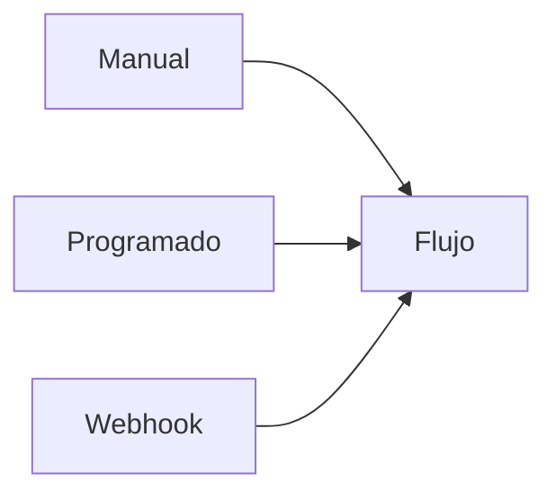
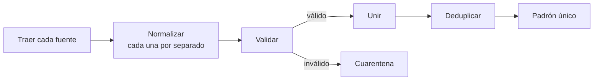
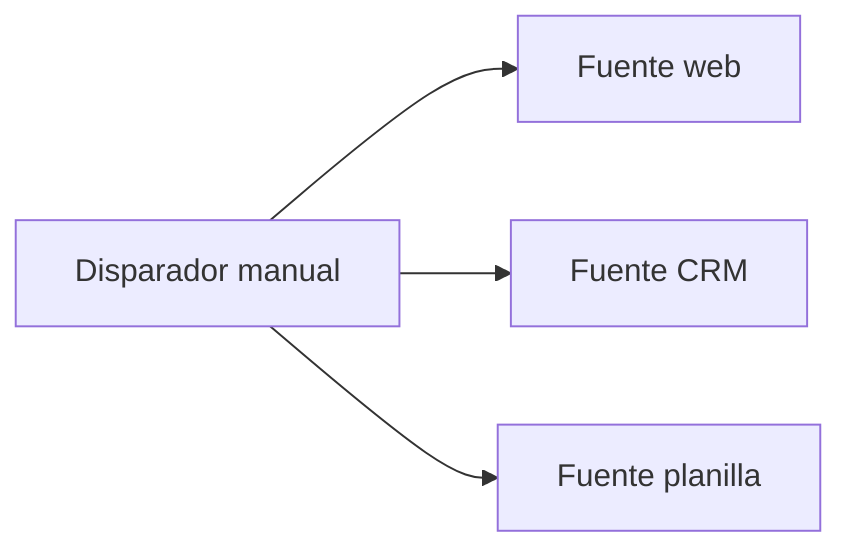
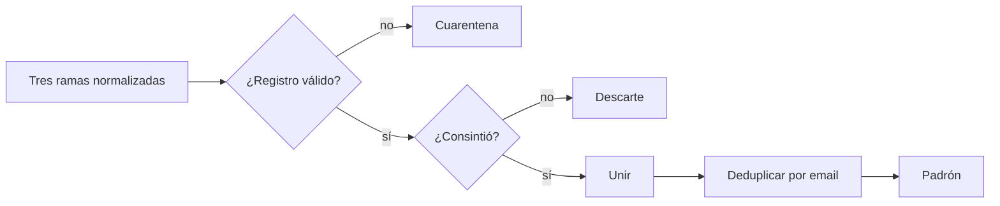

# Seminario de Automatización

<div class="wire"><span></span></div>

<div class="text-xl">Clase 2</div>
<div class="lead mt-1">Versionado, disparadores y homogeneización de información.</div>

<div class="mute text-sm mt-14">
Tecnicatura Universitaria en Programación<br>
Gonzalo Bechara Balaldi
</div>

<!--
Arrancar retomando los errores que quedaron anotados la clase pasada.
Es el puente natural hacia versionado: "¿cómo volvés al flujo de antes
de que lo rompieras?"
-->

---

## De dónde venimos

<div class="grid grid-cols-2 gap-8 mt-8">

<div>
<div class="ok text-sm mb-3">La clase pasada quedó funcionando</div>
<ul class="mute text-sm">
<li>Un flujo que lee de un servicio y escribe en otro (emulados)</li>
<li>Y un renombrado de campos hecho a mano</li>
</ul>
</div>

<div>
<div class="warn text-sm mb-3">Pero el flujo todavía no es realista</div>
<ul class="mute text-sm">
<li>¿Qué disparador es más correcto que el manual?</li>
<li>¿Y si mañana son cinco fuentes de datos en vez de una?</li>
<li>¿Qué pasa si rompo algo durante la edición?</li>
</ul>
</div>

</div>

<div class="lead mt-10">
Vamos a rediseñar nuestro flujo para adaptarlo a situaciones más realistas.
</div>


---
layout: section
class: section-break
---

# Versionado

<div class="wire"><span></span></div>

---

## flujo_clientes_v2_final_corregido_posta_imprimir.json

<div class="lead mt-6">
Tocaste tres nodos para probar una idea, no funcionó, y ahora tampoco funciona lo que funcionaba.
</div>

<div class="grid grid-cols-3 gap-4 mt-10 text-sm">

<div class="box box-warn">
<b>Deshacer no alcanza</b>
<div class="mute mt-2">Ctrl+z tiene patas cortas, sirve dentro de una sesión. Cerraste la pestaña y se terminó.</div>
</div>

<div class="box box-warn">
<b>Duplicar el flujo tampoco</b>
<div class="mute mt-2">A la tercera copia nadie sabe cuál es la buena. <code>flujo v2 FINAL ok</code>.</div>
</div>

<div class="box box-ok">
<b>Una versión más robusta</b>
<div class="mute mt-2">Tratar la automatización como lo que es: código. Y versionarlo como tal.</div>
</div>

</div>

<!--
Preguntar quién ya perdió trabajo así. Siempre levanta la mano alguien.
La anécdota del aula vale más que el argumento.
-->

---

## La definición es un archivo

<div class="grid grid-cols-2 gap-8 mt-6">

<div>

Todo el flujo —nodos, parámetros, conexiones, posiciones en el lienzo— vive en un único JSON que se puede exportar e importar.

<div class="box box-sig mt-5 text-sm">
Si es un archivo de texto, se puede trackear con Git.
</div>

Y todo lo que Git nos habilita se pone a nuestra disposición: historial, ramas, revisión entre pares, vuelta atrás.

<div class="mute text-sm mt-5">
Si no queremos usar git, tener nuestros flujos exportados y guardados en nuestra PC tampoco es mala idea, no es ideal pero es al menos algo.
</div>

</div>

<div v-pre>

```json
{
  "name": "encuesta-a-lista",
  "nodes": [
    {
      "parameters": { "url": "https://..." },
      "name": "Traer respuestas",
      "type": "n8n-nodes-base.httpRequest",
      "position": [460, 300]
    }
  ],
  "connections": {
    "Traer respuestas": {
      "main": [[{ "node": "Filtrar", "index": 0 }]]
    }
  }
}
```

</div>

</div>

<!--
Abrir el JSON exportado de la práctica 1 en vivo y recorrerlo: que vean que
"nodes" es una lista y "connections" un diccionario de aristas. Sin entrar en
detalle: alcanza con que pierdan el miedo al archivo.
-->

---

## Qué queda en el json y qué no

<div class="grid grid-cols-2 gap-8 mt-8 text-sm">

<div>
<div class="ok mb-3">Sí viaja</div>
<ul class="mute">
<li>Los nodos y su configuración</li>
<li>Las conexiones entre nodos</li>
<li>Las expresiones que escribiste</li>
<li>El nombre de la credencial usada</li>
<li>Las posiciones en el lienzo</li>
</ul>
</div>

<div>
<div class="warn mb-3">No viaja</div>
<ul class="mute">
<li>El valor de las credenciales</li>
<li>El historial de ejecuciones</li>
<li>Los datos que pasaron por el flujo</li>
<li>Los datos fijados para pruebas, según cómo exportes</li>
</ul>
</div>

</div>

<div class="box box-sig mt-8 text-sm">
El JSON dice <b class="sig">"acá va la credencial llamada tal"</b>, no cuál es la clave. Por eso se puede subir a un repositorio. Revisalo igual antes del primer commit.
</div>

<!--
Insistir: "por eso se puede subir" no es "por eso se sube sin mirar". Alguien
va a haber pegado una clave dentro de una URL en un nodo HTTP. Eso sí viaja.
-->

---


# Disparadores

<div class="wire"><span></span></div>

---

## Los tres tipos



<div class="grid grid-cols-3 gap-4 mt-8 text-sm">

<div class="box">
<b class="sig">Manual</b>
<div class="mute mt-2">Lo aprieta una persona. Para desarrollar, probar y para procesos que alguien decide cuándo correr.</div>
</div>

<div class="box">
<b class="sig">Programado</b>
<div class="mute mt-2">Corre cada tanto y va a buscar si hay algo nuevo. El flujo pregunta.</div>
</div>

<div class="box">
<b class="sig">Webhook</b>
<div class="mute mt-2">Alguien avisa que pasó algo y el flujo arranca. El flujo escucha.</div>
</div>

</div>

<div class="lead mt-8">
La diferencia de fondo entre los dos últimos es quién tiene la iniciativa.
</div>

<!--
"El flujo pregunta" contra "el flujo escucha" es la frase que hay que dejar
grabada. Todo lo demás sale de ahí.
-->

---

## Manual y programado: ir a buscar

<div class="grid grid-cols-2 gap-8 mt-6 text-sm">

<div>
<div class="ok mb-3">A favor</div>
<ul class="mute">
<li>Funciona aunque el otro sistema no sepa avisar</li>
<li>No hace falta exponer nada a internet</li>
<li>Si el flujo estuvo caído, la próxima corrida recupera</li>
<li>Controlás vos el ritmo</li>
</ul>
</div>

<div>
<div class="warn mb-3">En contra</div>
<ul class="mute">
<li>Latencia: en el peor caso, todo el intervalo</li>
<li>Consultas que no traen nada, todo el día</li>
<li>Podés pegarle a un límite de llamadas del proveedor</li>
<li>Hay que decidir qué es "nuevo"</li>
</ul>
</div>

</div>

<div class="box box-warn mt-8 text-sm">
Discutamos sobre los pros y contras: <b class="warn">¿qué pasa si una corrida tarda más que el intervalo?</b>.
</div>

<!--
Ejemplo concreto: cada 5 minutos, y una corrida tarda 7. A la hora hay
ejecuciones encimadas y contactos duplicados. Se resuelve con una marca de agua
y con no ser optimista con los intervalos.
-->

---

## ¿Cuáles elementos consideramos "nuevos"?

<div class="lead mt-4">
Un disparador programado o manual corre siempre igual: le toca decidir qué ya procesó y qué es nuevo.
</div>

<div class="mt-8 text-sm">

<div class="tramo">
<b class="sig">1</b>
<span><b>Timestamps.</b> Guardar la fecha del último registro traído y pedir solo lo posterior. Simple y suficiente casi siempre.</span>
<em>por fecha</em>
</div>

<div class="tramo">
<b class="sig">2</b>
<span><b>Lista de procesados.</b> Guardar los ids de los registros ya vistos y descartar los repetidos.</span>
<em>por id</em>
</div>

<div class="tramo">
<b class="sig">3</b>
<span><b>Estado en el origen.</b> Marcar el registro como procesado en el otro sistema, si te deja escribir.</span>
<em>por flag en el otro sistema</em>
</div>

</div>


<!--
Hoy no lo implementamos: la práctica corre con disparador manual. Pero hay que
nombrarlo ahora porque en la unidad 7 vuelve como problema serio.
-->

---

## Webhook: que te avisen

<div class="grid grid-cols-2 gap-8 mt-6 text-sm">

<div>
<div class="ok mb-3">A favor</div>
<ul class="mute">
<li>Reacción inmediata</li>
<li>Cero consultas al vacío</li>
<li>El otro sistema ya sabe qué cambió</li>
</ul>
</div>

<div>
<div class="warn mb-3">En contra</div>
<ul class="mute">
<li>El sistema con los datos de entrada debe tener la funcionalidad de avisar eventos</li>
<li>Tenés que estar escuchando y accesible</li>
<li>Si estabas caído, el evento se perdió o te lo reenvían</li>
<li>Cualquiera puede golpear esa puerta</li>
<li>El emisor decide el formato, no vos</li>
</ul>
</div>

</div>


<!--
No abrir el tema de la seguridad del webhook acá o se come la clase.
Solo dejar plantado que "que llegue" no es "que sea legítimo".
-->

---

## Cómo se elige

<div class="mt-6">

| Situación | Disparador |
| --- | --- |
| Estás construyendo y probando | Manual |
| Un cierre diario, semanal o mensual | Programado |
| El origen no tiene forma de avisar | Programado |
| Hace falta reaccionar en segundos | Webhook |
| El origen ya emite eventos | Webhook |
| El proceso lo decide una persona | Manual |
| El origen avisa pero no confiás en que siempre llegue | Webhook y además un programado de red |

</div>

<div class="mute text-xs mt-6">
La última fila es la combinación más común en producción: se escucha el evento y además se barre cada tanto por lo que se haya perdido.
</div>

<!--
Vale detenerse en la última fila. Es la respuesta a "¿y si el webhook falla?"
que siempre pregunta alguien.
-->

---
layout: section
class: section-break
---

# Homogeneizar

<div class="wire"><span></span></div>

---

## Tres sistemas, tres formas de decir lo mismo

<div class="grid grid-cols-3 gap-3 mt-6 text-xs">

<div class="box">
<b class="sig">Formulario web</b>
<div v-pre class="mt-2">

```json
{
  "contact": {
    "firstName": "Ana",
    "email": "ana@..."
  },
  "answers": {
    "consent": true
  }
}
```

</div>
</div>

<div class="box">
<b class="sig">CRM</b>
<div v-pre class="mt-2">

```json
{
  "full_name": "ANA  FERREYRA",
  "email_address": "ana@... ",
  "opt_in": "yes",
  "created": "28/02/2026"
}
```

</div>
</div>

<div class="box">
<b class="sig">Planilla</b>
<div v-pre class="mt-2">

```json
{
  "Nombre y Apellido": "Ana Ferreyra",
  "Correo": "ANA@...",
  "Acepta novedades": "Sí"
}
```

</div>
</div>

</div>

<div class="lead mt-8">
Es la misma persona tres veces. Ningún sistema está equivocado: cada uno resolvió su problema.
</div>

<!--
Este es el corazón de la clase. Que lo miren un rato en silencio antes de
que vos digas nada, y que ellos enumeren las diferencias.
-->

---

## En cuántas dimensiones difieren

<div class="grid grid-cols-2 gap-x-10 gap-y-3 mt-6 text-sm">

<div class="box"><b class="sig">Nombre</b><div class="mute mt-1"><code>email</code>, <code>email_address</code>, <code>Correo</code></div></div>
<div class="box"><b class="sig">Forma</b><div class="mute mt-1">Anidado en objetos contra todo plano</div></div>
<div class="box"><b class="sig">Tipo</b><div class="mute mt-1"><code>true</code> contra <code>"yes"</code> contra <code>"Sí"</code></div></div>
<div class="box"><b class="sig">Formato</b><div class="mute mt-1"><code>2026-03-02</code> contra <code>28/02/2026</code></div></div>
<div class="box"><b class="sig">Granularidad</b><div class="mute mt-1">Nombre y apellido separados contra juntos</div></div>
<div class="box"><b class="sig">Suciedad</b><div class="mute mt-1">Espacios, mayúsculas, dobles espacios, vacíos</div></div>
<div class="box"><b class="sig">Ausencia</b><div class="mute mt-1"><code>null</code>, <code>""</code> y "la clave no está" son tres cosas distintas</div></div>
<div class="box"><b class="sig">Superposición</b><div class="mute mt-1">La misma persona aparece en dos fuentes</div></div>

</div>

<!--
La séptima es la que más errores causa en la práctica de hoy. Detenerse:
null es "sé que no hay", "" es "hay algo y está vacío", ausente es "ni pregunté".
-->

---

## El orden importa

Ejecutar las operaciones en orden incorrecto puede generar ineficiencias de procesamiento o de mantenimiento del flujo.



<div class="grid grid-cols-2 gap-6 mt-8 text-sm">

<div class="box box-ok">
<b class="ok">Normalizar antes de unir</b>
<div class="mute mt-1">Cada fuente tiene sus propias mañas. Una vez unidas ya no sabés de dónde vino cada registro.</div>
</div>

<div class="box box-ok">
<b class="ok">Validar antes de deduplicar</b>
<div class="mute mt-1">Si la clave de deduplicación está sucia, la deduplicación no funciona.</div>
</div>

</div>

<!--
El error clásico es unir primero porque es lo cómodo, y después intentar limpiar
con un montón de condicionales. Sale un nodo de código de cien líneas.
-->

---

## Definir el destino primero

<div class="grid grid-cols-2 gap-8 mt-6">

<div>

Antes de tocar un nodo, se escribe la forma a la que todo tiene que llegar.

<div class="box box-sig mt-5 text-sm">
Con la <b class="sig">clave natural</b> decidida: el campo por el que dos registros son la misma cosa.
</div>

<div class="mute text-sm mt-5">
Después, una tabla de mapeo por fuente.
</div>

</div>

<div v-pre>

```json
{
  "email": "ana.ferreyra@ejemplo.com",
  "nombre": "Ana",
  "apellido": "Ferreyra",
  "telefono": "+543415550198",
  "organizacion": "Cooperativa El Molino",
  "cargo": "Analista de sistemas",
  "consentimiento": true,
  "fecha_alta": "2026-03-02",
  "origen": "web"
}
```

</div>

</div>

<!--
Repartir o proyectar el esquema-comun.json ahora. Es la especificación de la
práctica y conviene que lo tengan a la vista todo el tiempo.
-->

---

## La tabla de mapeo

<div class="mt-4">

| Destino | Formulario web | CRM | Planilla |
| --- | --- | --- | --- |
| `email` | `contact.email` | `email_address` | `Correo` |
| `nombre` | `contact.firstName` | `full_name` hasta el primer espacio | `Nombre y Apellido` idem |
| `apellido` | `contact.lastName` | resto de `full_name` | resto |
| `telefono` | `contact.phone` | `phone_number` | `Teléfono` |
| `organizacion` | `answers.company` | `org` | `Empresa` |
| `cargo` | `answers.role` | `job_title` | `Cargo` |
| `consentimiento` | `answers.consent` | `opt_in` | `Acepta novedades` |
| `fecha_alta` | `submittedAt` | `created` | `Fecha` |
| `origen` | `"web"` | `"crm"` | `"evento"` |

</div>


<!--
Notar que la fila de apellido ya tiene un problema escondido: "Jorge Da Silva"
y "Maria Jose Alvez" no se parten bien por el primer espacio. Dejarlo picando,
que lo descubran en la práctica.
-->

---

## Normalizar es aburrido y necesario

<div class="grid grid-cols-2 gap-8 mt-6 text-sm">

<div>

<div class="tramo"><b class="sig">▸</b><span><b>Texto.</b> Recortar los extremos, colapsar espacios dobles, decidir mayúsculas.</span></div>
<div class="tramo"><b class="sig">▸</b><span><b>Correo.</b> Siempre a minúsculas. Es la clave: si está sucia, no dedupliza.</span></div>
<div class="tramo"><b class="sig">▸</b><span><b>Teléfono.</b> Dejar solo dígitos y anteponer el prefijo.</span></div>

</div>

<div>

<div class="tramo"><b class="sig">▸</b><span><b>Fecha.</b> Todo a un mismo formato. Cuidado con día y mes intercambiados.</span></div>
<div class="tramo"><b class="sig">▸</b><span><b>Booleano.</b> Enumerar los valores verdaderos. Lo que no está en la lista no es verdadero.</span></div>
<div class="tramo"><b class="sig">▸</b><span><b>Vacíos.</b> Elegir una representación única y usarla en todo el flujo.</span></div>

</div>

</div>

<div class="box box-warn mt-6 text-sm">
<b class="warn">Regla de los booleanos:</b> listar lo que es verdadero, no lo que es falso. Si mañana aparece <code>"S"</code> preferís no dar consentimiento por error a darlo por error.
</div>

<!--
Esa regla es de criterio, no técnica: ante la duda, la opción segura es la que
no manda correos a quien no los pidió. Vale la pena decirlo con esas palabras.
-->

---

## Validar y deduplicar

<div class="grid grid-cols-2 gap-8 mt-8">

<div class="box box-warn">
<b class="warn">Validar</b>
<div class="mute text-sm mt-2">
Un registro inválido no se arregla ni se tira: se aparta con el motivo y el original adjunto.
</div>
<div class="text-sm mt-4 mute">
No hay que borrarlo -> Alguien tiene que poder revisarlo.
</div>
</div>

<div class="box box-sig">
<b class="sig">Deduplicar</b>
<div class="mute text-sm mt-2">
Dos registros con la misma clave natural son uno solo. Falta decidir cuál gana campo por campo.
</div>
<div class="text-sm mt-4 mute">
Prioridad por fuente, y la fecha más antigua siempre (puede tener datos acumulados de otras fuentes).
</div>
</div>

</div>

<div class="box box-sig mt-8 text-sm">
La deduplicación no es "quedarse con uno": es <b class="sig">fusionar</b>. El registro final puede tener el teléfono de una fuente y la empresa de otra.
</div>


---

## Nodos que sirven para esto

<div class="grid grid-cols-2 gap-x-10 gap-y-3 mt-8 text-sm">

<div class="box"><b class="sig">Editar campos</b><div class="mute mt-1">Renombrar, armar el objeto de destino, poner valores fijos como <code>origen</code>.</div></div>
<div class="box"><b class="sig">Separar en items</b><div class="mute mt-1">Cuando la respuesta trae un array adentro de un item, para convertirlo en muchos items.</div></div>
<div class="box"><b class="sig">Filtro</b><div class="mute mt-1">Descartar lo que no cumple, sin abrir una segunda rama.</div></div>
<div class="box"><b class="sig">Condicional</b><div class="mute mt-1">Cuando el descarte también tiene que ir a algún lado.</div></div>
<div class="box"><b class="sig">Unir</b><div class="mute mt-1">Juntar las tres fuentes ya normalizadas en un solo caudal.</div></div>
<div class="box"><b class="sig">Quitar duplicados</b><div class="mute mt-1">Por el campo que definiste como clave natural.</div></div>

</div>

<div class="box box-warn mt-6 text-sm">
El nodo de código sigue siendo la salida de emergencia. Si el flujo entero es un nodo de código, perdiste el registro paso a paso, que es lo que te va a salvar cuando falle.
</div>

<!--
La tentación de hoy es enorme: todo esto son veinte líneas de JavaScript.
Aceptar código solo para el partido de nombre y apellido, y para nada más.
-->

---
layout: section
class: section-break
---

# Caso de uso

<div class="wire"><span></span></div>

---

## Tres canales de entrada

<div class="lead mt-4">
Una jornada abierta a la comunidad. La gente se inscribió por tres vías distintas y ahora hay que mandar un correo único.
</div>

<div class="grid grid-cols-3 gap-4 mt-8 text-sm">

<div class="box">
<b class="sig">Formulario web</b>
<div class="mute mt-2">La inscripción oficial. JSON anidado, correcto, con consentimiento explícito.</div>
</div>

<div class="box">
<b class="sig">CRM</b>
<div class="mute mt-2">Contactos que ya existían y se anotaron por teléfono. Exportación plana en inglés.</div>
</div>

<div class="box">
<b class="sig">Planilla del día</b>
<div class="mute mt-2">Lo que cargó la recepción a mano durante el evento. Columnas en español.</div>
</div>

</div>

<div class="box box-warn mt-8 text-sm">
Hay gente que se anotó por dos vías. Hay registros que nunca dieron consentimiento. Y hay al menos un correo que no es un correo.
</div>


---

## Qué hay que producir

<div class="mt-6 text-sm">

<div class="tramo"><b>1</b><span>Un <b>padrón</b> de contactos únicos, válidos y con consentimiento</span><em>la salida buena</em></div>
<div class="tramo"><b>2</b><span>Una <b>cuarentena</b> con lo que no pasó la validación, y el motivo de cada caso</span><em>revisable</em></div>
<div class="tramo"><b>3</b><span>Un <b>descarte</b> de los que dijeron que no querían recibir novedades</span><em>separado</em></div>
<div class="tramo"><b>4</b><span>Un <b>conteo</b> que cierre: entradas totales igual a la suma de las tres salidas</span><em>la verificación</em></div>

</div>

<div class="box box-sig mt-8 text-sm">
El punto 4 es el que hace verificable al ejercicio. Si la cuenta no cierra, se perdieron registros en silencio, que es exactamente lo que una automatización no puede hacer.
</div>

<!--
Escribir en el pizarrón el total de registros de entrada apenas empiecen, y
dejarlo ahí toda la práctica. Es el número contra el que van a chequear.
-->

---

## Por qué no separar el consentimiento de la cuarentena

<div class="grid grid-cols-3 gap-4 mt-10 text-sm">

<div class="box box-ok">
<b class="ok">Consentimiento en falso</b>
<div class="mute mt-2">El dato está bien y la persona dijo que no. No hay nada que revisar ni que arreglar.</div>
</div>

<div class="box box-warn">
<b class="warn">Consentimiento ausente</b>
<div class="mute mt-2">No sabemos qué dijo. Es indeterminado, no negativo, y alguien tiene que averiguarlo.</div>
</div>

<div class="box box-warn">
<b class="warn">Registro inválido</b>
<div class="mute mt-2">El dato está roto. Puede tener arreglo, pero no lo decide el flujo.</div>
</div>

</div>

<div class="lead mt-10">
Tres motivos distintos para no mandar un correo, con tres tratamientos distintos. Meterlos en la misma bolsa es perder información.
</div>

<!--
Esta distinción es la que separa un ejercicio escolar de un flujo que sirve.
En el conjunto de datos hay un caso de cada uno, a propósito.
-->

---
layout: section
class: section-break
---

# Práctica guiada

<div class="wire"><span></span></div>

---

## Paso 1 — Traer las tres fuentes



<div class="grid grid-cols-2 gap-6 mt-8 text-sm">

<div class="box">
<b class="sig">Ojo con la forma de la respuesta</b>
<div class="mute mt-1">La fuente web devuelve un objeto con un array adentro. Las otras dos devuelven el array directo. No llegan como la misma cantidad de items.</div>
</div>

<div class="box box-ok">
<b class="ok">Antes de seguir</b>
<div class="mute mt-1">Contar los items a la salida de cada rama. Tienen que ser 8, 7 y 7.</div>
</div>

</div>

<!--
Muchos van a ver un solo item en la rama web y van a suponer que la fuente trajo
un registro. Es el mismo error que la clase pasada: hay que separar el array.
-->

---

## Paso 2 — Normalizar cada rama

<div class="lead mt-4">
Tres ramas paralelas, cada una con su propio mapeo, todas terminando en la misma forma.
</div>

<div class="grid grid-cols-3 gap-4 mt-8 text-xs">

<div class="box">
<b class="sig">Rama web</b>
<div class="mute mt-2">Aplanar el anidado. Nombre y apellido ya vienen separados. Consentimiento ya es booleano.</div>
</div>

<div class="box">
<b class="sig">Rama CRM</b>
<div class="mute mt-2">Partir el nombre completo. Convertir <code>"yes"</code>. Dar vuelta la fecha de día, mes y año.</div>
</div>

<div class="box">
<b class="sig">Rama planilla</b>
<div class="mute mt-2">Claves con espacios y acentos. Partir el nombre. Convertir las variantes de sí.</div>
</div>

</div>

<div class="box box-warn mt-8 text-sm">
Antes de unir, abrir la salida de las tres ramas y confirmar que los objetos son <b class="warn">idénticos en estructura</b>. Mismas claves, mismos tipos. Si difieren acá, todo lo que sigue va a fallar de forma confusa.
</div>

<!--
Vale la pena parar la clase acá y esperar a que todos tengan las tres ramas
alineadas. Es el punto de sincronización de la práctica.
-->

---

## Paso 3 — Validar, unir y deduplicar



<div class="grid grid-cols-2 gap-6 mt-6 text-sm">
<div class="box box-sig">
<b class="sig">La clave</b>
<div class="mute mt-1">Deduplicar por el correo ya normalizado. Si quedó un espacio o una mayúscula, dos registros iguales no se van a reconocer.</div>
</div>
<div class="box box-ok">
<b class="ok">La verificación</b>
<div class="mute mt-1">22 entradas. Padrón más cuarentena más descarte más duplicados absorbidos tiene que dar 22.</div>
</div>
</div>

<!--
Si alguien llega a 22 a la primera, pedirle que muestre cómo contó los
duplicados absorbidos. Casi siempre están contados de más o de menos.
-->

---

## Lo que probablemente falle

<div class="grid grid-cols-2 gap-6 mt-8 text-sm">

<div class="box box-warn"><b>Sobran o faltan registros</b><div class="mute mt-1">La rama web trajo un item en vez de ocho. El array nunca se separó.</div></div>
<div class="box box-warn"><b>La deduplicación no agarra nada</b><div class="mute mt-1">Se está comparando el correo original y no el normalizado. Espacios y mayúsculas.</div></div>
<div class="box box-warn"><b>Un apellido quedó partido mal</b><div class="mute mt-1">"Da Silva" y "Maria Jose Alvez" no se parten por el primer espacio. Hay que elegir una regla y declararla.</div></div>
<div class="box box-warn"><b>Entró alguien sin consentimiento</b><div class="mute mt-1">Un valor nulo se evaluó como verdadero, o la lista de valores afirmativos no contemplaba una variante.</div></div>
<div class="box box-warn"><b>Una fecha imposible pasó sin quejarse</b><div class="mute mt-1">El 31 de febrero se convirtió en marzo en silencio. Validar antes de convertir.</div></div>
<div class="box box-warn"><b>La cuenta no cierra por poco</b><div class="mute mt-1">Casi siempre es un duplicado dentro de una misma fuente, no entre fuentes.</div></div>

</div>

<!--
Esta diapositiva es para proyectar durante la práctica, no para leer de corrido.
Dejarla puesta mientras recorrés el aula.
-->

---

## Cierre

<div class="grid grid-cols-2 gap-10 mt-8">

<div>
<div class="sig text-sm mb-3">Hoy vimos</div>
<ul class="mute text-sm">
<li>La definición del flujo como archivo versionable</li>
<li>Manual, programado y webhook, y con qué criterio se elige</li>
<li>Normalizar, validar, unir y deduplicar, en ese orden</li>
</ul>
</div>

<div>
<div class="warn text-sm mb-3">Qué falló durante la práctica</div>
<div class="box box-warn text-sm mute">
Repaso en vivo de los errores que aparecieron hoy en el aula.
</div>
</div>

</div>

<!-- <div class="box box-sig mt-8 text-sm">
<b class="sig">Para la clase que viene</b>
<div class="mute mt-1">
Subir al repositorio la definición del flujo de hoy en <code>clase-02/</code>, con la captura de las tres salidas y sus conteos. Y pensar una respuesta a esta pregunta: si en vez de correr a mano el flujo lo dispara un aviso del otro sistema, ¿cómo sabés que ese aviso es legítimo?
</div>
</div> -->

<!--
Dejar la pregunta picando sin responderla. Es la apertura literal de la clase 3.
-->

---
layout: center
class: text-center
---