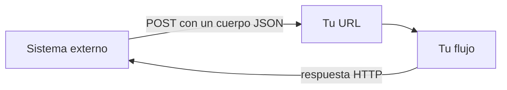
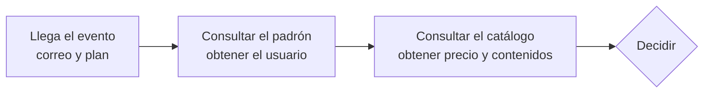
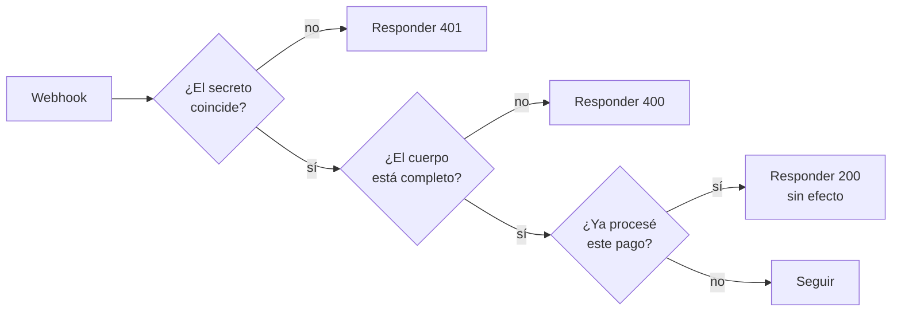
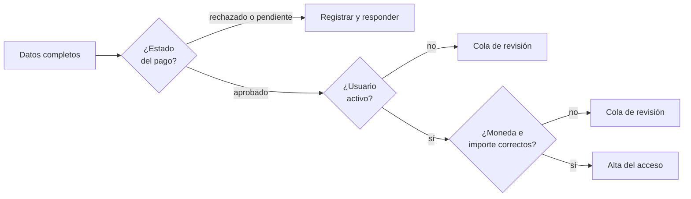

# Seminario de Automatización

<div class="wire"><span></span></div>

<div class="text-xl">Clase 3</div>
<div class="lead mt-1">Webhooks y decisiones estructuradas.</div>

<div class="mute text-sm mt-14">
Tecnicatura Universitaria en Programación<br>
Gonzalo Bechara Balaldi
</div>

<!--
Abrir con la pregunta que quedó de la clase 2: si el flujo lo dispara un aviso
externo, ¿cómo sabés que ese aviso es legítimo? Escuchar dos o tres respuestas
antes de avanzar.
-->

---

## De dónde venimos

<div class="grid grid-cols-2 gap-8 mt-8">

<div>
<div class="ok text-sm mb-3">Ya sabemos</div>
<ul class="mute text-sm">
<li>Modelar un proceso y llevarlo a un flujo</li>
<li>Homogeneizar lo que producen distintos sistemas</li>
<li>Versionar la definición</li>
<li>Que hay tres formas básicas de disparar un flujo</li>
</ul>
</div>

<div>
<div class="sig text-sm mb-3">Hoy</div>
<ul class="mute text-sm">
<li>Complejizamos los flujos</li>
<li>Iniciamos con un webhook</li>
</ul>
</div>

</div>

<div class="lead mt-10">
Es la primera clase en la que el flujo no va a buscar nada: espera.
</div>

<!--
Hasta hoy todo lo que hicieron corría cuando ellos apretaban un botón. A partir
de acá el flujo existe aunque nadie lo mire, y eso cambia todo lo que hay que
tener en cuenta.
-->

---
layout: section
class: section-break
---

# Recibir

<div class="wire"><span></span></div>

---

## Qué es realmente un webhook

<div class="lead mt-4">
Una URL tuya que otro sistema conoce, y a la que le manda un pedido cuando pasa algo.
</div>



<div class="box box-sig mt-8 text-sm">
Es un servidor HTTP con una ruta. Lo único distinto es que <b class="sig">vos no controlás quién le pega ni cuándo</b>.
</div>

<!--
Desmitificar. Muchos llegan pensando que un webhook es una tecnología aparte.
Es una ruta que espera un POST, y ya escribieron cosas así en otras materias.
-->

---

## Lo que llega

<div class="grid grid-cols-2 gap-8 mt-6">

<div>

<div class="tramo"><b class="sig">▸</b><span><b>Método y ruta.</b> Casi siempre POST a una URL con un identificador impredecible.</span></div>
<div class="tramo"><b class="sig">▸</b><span><b>Cabeceras.</b> El tipo de contenido, y muy seguido la prueba de autenticidad.</span></div>
<div class="tramo"><b class="sig">▸</b><span><b>Cuerpo.</b> El evento en sí. Formato que decide el emisor.</span></div>

</div>

<div v-pre>

```http
POST /webhook/cobros HTTP/1.1
content-type: application/json
x-webhook-secret: s3m1n4r10-auto-2026

{
  "id": "evt_2001",
  "type": "payment.succeeded",
  "data": {
    "payment_id": "pay_9001",
    "status": "approved",
    "amount": 24500,
    "currency": "ARS"
  }
}
```

</div>

</div>

<!--
Marcar que el secreto viaja en la cabecera y no en el cuerpo. Es la primera vez
en el seminario que las cabeceras importan de verdad.
-->

---

## URL de prueba y URL de producción

<div class="grid grid-cols-2 gap-8 mt-10">

<div class="box box-sig">
<b class="sig">De prueba</b>
<div class="mute text-sm mt-2">
Solo escucha mientras el editor está abierto y esperando. El evento aparece en pantalla y podés inspeccionarlo nodo por nodo.
</div>
<div class="text-sm mt-4 mute">Para construir.</div>
</div>

<div class="box box-ok">
<b class="ok">De producción</b>
<div class="mute text-sm mt-2">
Escucha siempre, con el flujo activo. No vas a ver nada en vivo: queda en el registro de ejecuciones.
</div>
<div class="text-sm mt-4 mute">Para que funcione.</div>
</div>

</div>

<div class="box box-warn mt-8 text-sm">
Son <b class="warn">dos URLs distintas</b>. Un error común es configurar el emisor con la de prueba, y al olvidarse de cambiarlo, darse cuenta tres días después que no llegó nada.
</div>

<!--
Decirlo dos veces. Y volver a decirlo cuando empiece la práctica.
-->

---

## Responder

<div class="grid grid-cols-2 gap-8 mt-6 text-sm">

<div>
<div class="sig mb-3">Cuándo</div>
<div class="box mb-3">
<b>Al recibir</b>
<div class="mute mt-1">Contestás enseguida y seguís procesando por dentro. El emisor se va tranquilo.</div>
</div>
<div class="box">
<b>Al terminar</b>
<div class="mute mt-1">Contestás con el resultado del proceso. Solo si el proceso es corto y al emisor le sirve la respuesta.</div>
</div>
</div>

<div>
<div class="sig mb-3">Qué</div>

| Código | Cuándo |
| --- | --- |
| `200` | Ok - Lo recibí y me hago cargo |
| `400` | Bad request - Tu cuerpo no cumple el contrato |
| `401` | Unauthorized - No pudiste probar quién sos |
| `409` | Conflict - Esto ya me lo mandaste |
| `500` | Internal server error - Se rompió algo mío |

</div>

</div>

<div class="box box-warn mt-6 text-sm">
Si tardás mucho en contestar, el emisor asume que fallaste y <b class="warn">te reenvía el mismo evento</b>.
</div>

<!--
El bucle clásico: proceso lento, el emisor reintenta, ahora hay dos ejecuciones,
más lento todavía, reintenta de nuevo. Se cae solo por diseño.
-->

---

## ¿Cómo verificamos que solo procesemos mensajes legítimos?

<div class="lead mt-4">
La URL está abierta a internet. Cualquiera que la adivine o la filtre puede mandarte un cobro aprobado.
</div>

<div class="grid grid-cols-3 gap-4 mt-8 text-sm">

<div class="box box-warn">
<b class="warn">URL secreta</b>
<div class="mute mt-2">Confiar en que nadie adivine la ruta. Es lo mínimo y no alcanza: las URLs se filtran en registros, capturas y repositorios.</div>
</div>

<div class="box box-sig">
<b class="sig">Secreto compartido</b>
<div class="mute mt-2">Una cabecera con una clave que solo ustedes dos conocen. Simple, suficiente para hoy.</div>
</div>

<div class="box box-ok">
<b class="ok">Firma del contenido</b>
<div class="mute mt-2">El emisor firma el cuerpo con una clave. Prueba quién lo mandó <b>y</b> que nadie lo modificó en el camino.</div>
</div>

</div>


<!--
El punto que hay que dejar claro: sin verificación, un webhook de cobros es
un formulario público para regalar acceso pago. Dicho así se entiende solo.
-->

---

## Validar el cuerpo

<div class="mt-6 text-sm">

<div class="tramo">
<b class="sig">1</b>
<span><b>¿Está el campo?</b> Los obligatorios tienen que existir. Ausente y vacío no son lo mismo.</span>
<em>presencia</em>
</div>

<div class="tramo">
<b class="sig">2</b>
<span><b>¿Es del tipo esperado?</b> Un importe que llega como texto se compara distinto que uno que llega como número.</span>
<em>tipo</em>
</div>

<div class="tramo">
<b class="sig">3</b>
<span><b>¿Tiene un valor posible?</b> Un estado que no está en la lista conocida no se procesa por las dudas.</span>
<em>dominio</em>
</div>

<div class="tramo">
<b class="sig">4</b>
<span><b>¿Tiene sentido?</b> Un importe negativo, una fecha del futuro, una moneda que no manejamos.</span>
<em>coherencia</em>
</div>

</div>

<div class="box box-sig mt-8 text-sm">
Todo lo que no pasa la validación se responde con <code>400</code> y no se procesa. Un cuerpo que no cumple el contrato es un problema del emisor.
</div>

---

## Eventos replicados - Idempotencia

<div class="grid grid-cols-2 gap-8 mt-6">

<div>

El mismo evento va a llegar dos veces. No es una posibilidad remota: es lo que hace todo emisor serio cuando duda de que le hayas contestado.

<div class="box box-warn mt-5 text-sm">
Si tu flujo otorga un acceso por cada evento recibido, un reintento otorga dos.
</div>

<div class="mute text-sm mt-5">
La defensa es una clave de idempotencia: el identificador del hecho, no el del aviso.
Idempotencia: Propiedad para realizar una acción determinada varias veces y aun así conseguir el mismo resultado que se obtendría si se realizase una sola vez.
</div>

</div>

<div>

<div class="box box-sig text-sm">
<b class="sig">Cuál es la clave</b>
<div class="mute mt-2">
El identificador del <b>pago</b>, no el del evento. Dos avisos distintos pueden referirse al mismo cobro.
</div>
</div>

<div class="box box-ok text-sm mt-4">
<b class="ok">Qué hacer con el repetido</b>
<div class="mute mt-2">
Responder lo mismo que la primera vez y no volver a ejecutar el efecto. El emisor no tiene que notar la diferencia.
</div>
</div>

</div>
</div>

<!--
En el conjunto de datos hay un evento con id distinto y payment_id repetido,
justamente para que el que deduplique por el campo equivocado lo descubra.
-->

---
layout: section
class: section-break
---

# Decidir

<div class="wire"><span></span></div>

---

## Enumerar antes de dibujar

<div class="lead mt-4">
Antes de tocar un nodo condicional, la tabla de decisión completa. Todos los casos, incluido el que no encaja en ninguno.
</div>

<div class="mt-8">

| Condición | Qué se hace | Qué se responde |
| --- | --- | --- |
| Pago aprobado, todo verifica | Otorgar el acceso | `200` |
| Pago rechazado | Nada, avisar a comercial | `200` |
| Pago pendiente | Nada, esperar el evento final | `200` |
| El importe no coincide | Nada, cola de revisión | `200` |
| El usuario no existe | Nada, cola de revisión | `200` |
| El cuerpo está incompleto | Nada | `400` |
| Cualquier otra cosa | Cola de revisión | `200` |

</div>


<!--
Insistir en la última fila. El caso por defecto que no hace nada y no registra
nada es la fuente número uno de "el sistema perdió mi pago".
-->

---

## Filtro, condicional o selector

<div class="grid gap-4 mt-10 text-sm">

<div class="box">
<b class="sig">Filtro</b>
<div class="mute mt-2">Limpiamos lo que no nos interesa. Una sola salida.</div>
<div class="mt-3 ok text-xs">Cuando el descarte no importa.</div>
</div>

<div class="box">
<b class="sig">Condicional (If)</b>
<div class="mute mt-2">Dos salidas: cumple y no cumple. Las dos van a algún lado.</div>
<div class="mt-3 ok text-xs">Cuando hay 2 opciones importantes.</div>
</div>

<div class="box">
<b class="sig">Selector (Switch)</b>
<div class="mute mt-2">Varias salidas según el valor de un campo, más una salida por defecto.</div>
<div class="mt-3 ok text-xs">Cuando los casos son tres o más.</div>
</div>

</div>


---

## Comparaciones engañosas

<div class="grid grid-cols-2 gap-x-10 gap-y-3 mt-8 text-sm">

<div class="box"><b class="warn">Texto contra número</b><div class="mute mt-1"><code>"24500"</code> no es <code>24500</code>. El JSON del emisor decide cuál te llega.</div></div>
<div class="box"><b class="warn">Mayúsculas</b><div class="mute mt-1"><code>"Approved"</code> no es <code>"approved"</code>. Normalizá antes de comparar.</div></div>
<div class="box"><b class="warn">Unidades</b><div class="mute mt-1">Centavos contra pesos. Muchas plataformas de pago mandan el importe en centavos.</div></div>
<div class="box"><b class="warn">Moneda</b><div class="mute mt-1">55 es menor que 48000, y sin embargo 55 dólares no son menos que 48000 pesos.</div></div>

</div>

---

## El webhook nunca trae todo

<div class="lead mt-4">
El emisor manda lo que sabe. Lo que hace falta para decidir casi siempre vive en otro lado.
</div>



<div class="grid grid-cols-2 gap-6 mt-8 text-sm">
<div class="box box-sig">
<b class="sig">Lo que trae</b>
<div class="mute mt-1">Correo del pagador, código de plan, importe, moneda, estado.</div>
</div>
<div class="box box-warn">
<b class="warn">Lo que falta</b>
<div class="mute mt-1">El identificador interno del usuario, su estado, el precio real del plan y qué contenidos incluye.</div>
</div>
</div>

<!--
Este es el enganche con la unidad 4: cada consulta a otro sistema es un punto
donde algo se puede caer. Hoy asumimos que responden; la clase que viene no.
-->

---
layout: section
class: section-break
---

# Caso de uso

<div class="wire"><span></span></div>

---

## Un cobro que otorga un acceso

<div class="lead mt-4">
La plataforma de pagos avisa que alguien pagó. Hay que darle acceso al contenido que compró, y solo a ese.
</div>

<div class="grid grid-cols-3 gap-4 mt-8 text-sm">

<div class="box">
<b class="sig">Pagos</b>
<div class="mute mt-2">Emite el evento. No lo controlamos: manda lo que quiere, cuando quiere, y reintenta si duda.</div>
</div>

<div class="box">
<b class="sig">Padrón</b>
<div class="mute mt-2">Sabe quién es cada correo, su identificador interno y si está habilitado.</div>
</div>

<div class="box">
<b class="sig">Catálogo</b>
<div class="mute mt-2">Sabe cuánto vale cada plan, cuánto dura y qué contenidos incluye.</div>
</div>

</div>

<div class="box box-warn mt-8 text-sm">
Si este flujo falla: o alguien pagó y no puede entrar, o alguien entró sin pagar.
</div>

<!--
Aclarar que los tres servicios están emulados por la cátedra. El de pagos lo
disparamos nosotros con el conjunto de eventos.
-->

---
layout: section
class: section-break
---

# Práctica guiada

<div class="wire"><span></span></div>

---

## Paso 1 — Recibir y contestar

<div class="mt-6 text-sm">

<div class="tramo"><b>a</b><span>Un flujo nuevo con disparador de webhook, método POST</span><em>escuchar</em></div>
<div class="tramo"><b>b</b><span>Copiar la URL de prueba y disparar un evento contra ella</span><em>probar</em></div>
<div class="tramo"><b>c</b><span>Mirar qué llegó: cuerpo, cabeceras, y cómo lo acomodó la plataforma</span><em>observar</em></div>
<div class="tramo"><b>d</b><span>Responder <code>200</code> antes de hacer nada más</span><em>contestar</em></div>

</div>

<div class="box box-sig mt-8 text-sm">
Antes de agregar un solo nodo de lógica, el flujo tiene que recibir y contestar. Todo lo demás se construye adentro de ese esqueleto.
</div>

<!--
El error de siempre es construir toda la lógica primero y dejar la respuesta
para el final. Después el emisor reintenta y nadie entiende por qué hay
ejecuciones duplicadas.
-->

---

## Paso 2 — La puerta



<div class="box box-warn mt-8 text-sm">
Las tres verificaciones van <b class="warn">antes</b> de cualquier consulta a otro sistema. No tiene sentido ir a buscar un usuario para un evento que no vamos a procesar.
</div>

<!--
Para la idempotencia alcanza hoy con una lista de pagos ya vistos guardada en
el mismo flujo o en una tabla de la plataforma. No hace falta nada sofisticado.
-->

---

## Paso 3 — Completar los datos

<div class="grid grid-cols-2 gap-6 mt-8 text-sm">

<div class="box">
<b class="sig">Buscar el usuario</b>
<div class="mute mt-1">Por el correo del pagador. Traer el identificador interno y el estado. Si no aparece, el camino termina en la cola de revisión.</div>
</div>

<div class="box">
<b class="sig">Buscar el plan</b>
<div class="mute mt-1">Por el código que vino en el evento. Traer precio, duración y contenidos. Si no aparece, cola de revisión.</div>
</div>

</div>

<div class="box box-warn mt-8 text-sm">
Comparar el correo <b class="warn">normalizado</b> contra el padrón. Es la misma lección de la clase pasada, y hoy vuelve a morder.
</div>

<!--
Recordar que las dos consultas pueden fallar por razones distintas: "no
encontré" y "no pude preguntar" no son lo mismo. Lo segundo es la unidad 4.
-->

---

## Paso 4 — Decidir y ejecutar



<div class="grid grid-cols-2 gap-6 mt-6 text-sm">
<div class="box box-sig">
<b class="sig">El alta lleva</b>
<div class="mute mt-1">El identificador del usuario, la lista de contenidos del plan, la fecha de vencimiento y el identificador del pago.</div>
</div>
<div class="box box-ok">
<b class="ok">El vencimiento</b>
<div class="mute mt-1">Se calcula sobre la fecha <b>del evento</b>, no sobre la de ejecución. La diferencia no se nota hoy y sí en producción.</div>
</div>
</div>

<!--
El identificador del pago viaja en el alta para que el servicio de accesos
también pueda descartar duplicados. La idempotencia se defiende en las dos puntas.
-->

---

## Paso 5 — Pasar los trece

<div class="lead mt-4">
Disparar los eventos en orden y verificar, uno por uno, qué respondió el flujo y qué efecto tuvo.
</div>

<div class="grid grid-cols-3 gap-4 mt-8 text-sm">

<div class="box box-ok">
<b class="ok">Dos accesos otorgados</b>
<div class="mute mt-2">Y ninguno más. Si son tres, algo se coló.</div>
</div>

<div class="box box-sig">
<b class="sig">Una cola de revisión poblada</b>
<div class="mute mt-2">Con el motivo de cada caso escrito, no solo el evento crudo.</div>
</div>

<div class="box box-warn">
<b class="warn">Un <code>400</code> y un <code>401</code></b>
<div class="mute mt-2">Y ningún otro código de error en todo el lote.</div>
</div>

</div>

<div class="box box-warn mt-8 text-sm">
Si aparece un <code>404</code> o un <code>500</code> en algún caso, revisar por qué: casi siempre es una decisión de negocio disfrazada de error técnico.
</div>

<!--
Ese chequeo final es la mejor forma de detectar el 404 en el usuario
desconocido, que es el error conceptual más frecuente de la clase.
-->

---

## Lo que probablemente falle

<div class="grid grid-cols-2 gap-6 mt-8 text-sm">

<div class="box box-warn"><b>No llega nada</b><div class="mute mt-1">Está configurada la URL de prueba y el editor no está escuchando. O el flujo no está activo.</div></div>
<div class="box box-warn"><b>El secreto nunca coincide</b><div class="mute mt-1">Las cabeceras se leen en minúsculas. Y el campo está en la cabecera, no en el cuerpo.</div></div>
<div class="box box-warn"><b>El repetido otorgó dos veces</b><div class="mute mt-1">Se deduplicó por el identificador del evento en vez del identificador del pago.</div></div>
<div class="box box-warn"><b>El evento en dólares otorgó acceso</b><div class="mute mt-1">Se comparó el importe sin mirar la moneda primero.</div></div>
<div class="box box-warn"><b>El pendiente otorgó acceso</b><div class="mute mt-1">Se preguntó si el estado no es rechazado, en vez de preguntar si es aprobado.</div></div>
<div class="box box-warn"><b>Un caso desapareció</b><div class="mute mt-1">Falta la rama por defecto. Trece eventos entran, trece tienen que salir por algún lado.</div></div>

</div>

<!--
La quinta es sutil y muy común: "distinto de rechazado" incluye pendiente,
en proceso, en disputa y todo lo que el emisor invente el mes que viene.
Preguntar por lo que se espera, no por lo que se descarta.
-->

---

## Cierre

<div class="grid grid-cols-2 gap-10 mt-8">

<div>
<div class="sig text-sm mb-3">Hoy vimos</div>
<ul class="mute text-sm">
<li>Recibir, validar, autenticar y responder</li>
<li>Idempotencia y por qué el mismo evento llega dos veces</li>
<li>Enumerar los casos antes de dibujar la bifurcación</li>
<li>Completar con consultas lo que el evento no trae</li>
<li>Sistemas aún más complejos que los anteriores</li>
</ul>
</div>


</div>